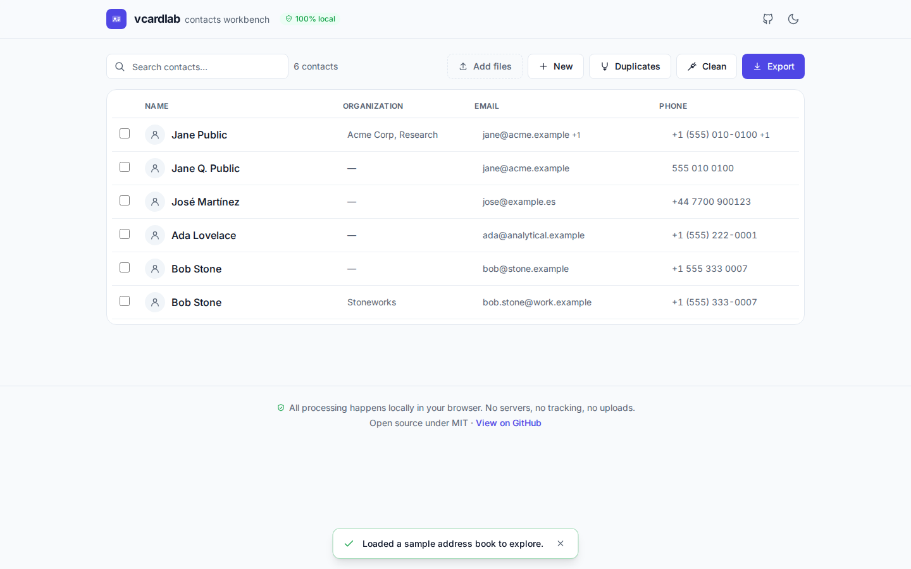
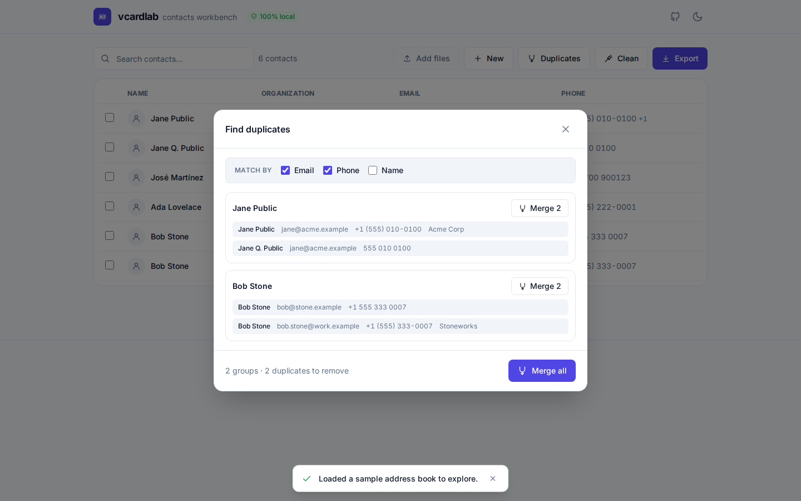
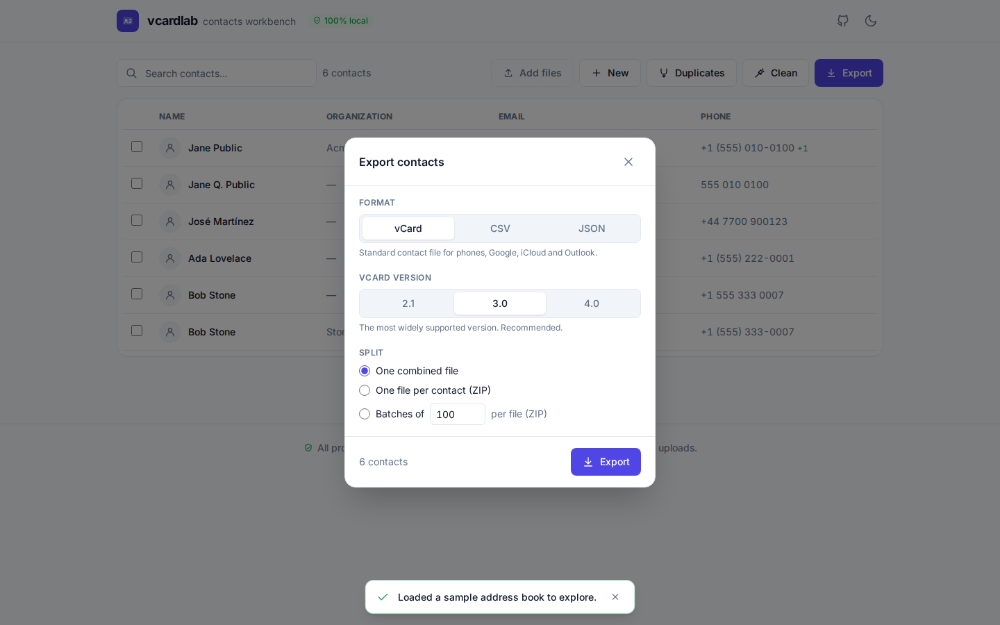
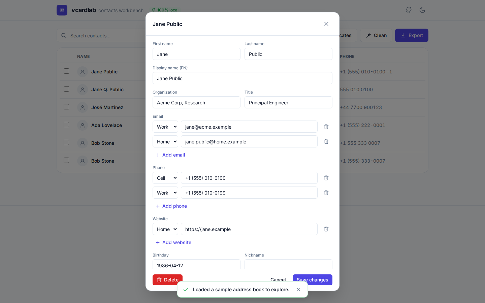
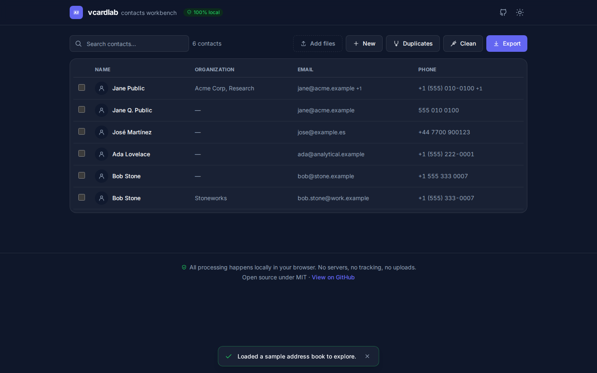

<div align="center">

# vcardlab

**A privacy-first, 100% in-browser vCard (`.vcf`) contacts workbench.**

View · edit · de-duplicate · merge · split · clean · convert — your address book, in your browser. **Nothing is uploaded.**

[**▶ Open the live app**](https://skytuhua.github.io/vcardlab/) · [Report an issue](https://github.com/Skytuhua/vcardlab/issues)



</div>

---

## Why vcardlab?

Your contacts are some of the most sensitive data you own — full names, phone numbers, home
addresses, emails, birthdays. Yet the usual ways to wrangle a `.vcf` file are bad:

- **Online converters** quietly **upload your entire address book** to a server.
- **Desktop tools** are paid, Windows-only `.exe` installers with dated interfaces.
- **Single-purpose sites** only split *or* only merge *or* only convert — never the whole job.

**vcardlab does the whole job in one place, entirely on your device.** It's a static web app:
your files are read locally with the browser File API, processed in memory, and downloaded back
to you. There is no server, no account, no tracking, and **no network request ever carries your
contact data** (the app even self-hosts its font so it phones home to nobody).

## Who it's for

People switching phones (Android ⇄ iPhone), consolidating Google / iCloud / Outlook address
books, cleaning up years of duplicates, preparing a contact list for a CRM or mail-merge, or
splitting a giant export so a picky phone will import it.

## Features

| | |
|---|---|
| **Import** | Drop one or many `.vcf` files. Parses vCard **2.1 / 3.0 / 4.0**, including line folding, quoted-printable (Android exports), grouped properties and structured names/addresses. Malformed cards are reported, never fatal. |
| **View & search** | A fast, virtualized table (cards on mobile) that stays smooth with large address books. Full-text search across every field, with match highlighting. Click any contact to see and edit every parsed field. |
| **Edit** | Edit names, organizations, titles, typed emails/phones/websites, postal addresses, birthdays and notes. Add or delete contacts. |
| **De-duplicate** | Find duplicates by **email**, **phone** (format/country-code-aware) and/or **name**. Review groups and merge them — or merge everything in one click. Merging takes the **union** of all fields, so nothing is lost. |
| **Clean & fix** | Repair garbled text (`Café` → `Café`), strip embedded photos, trim whitespace, normalize phone formatting, drop empty cards. |
| **Convert & split** | Export to **vCard** (choose 2.1 / 3.0 / 4.0), **CSV** (spreadsheet/CRM-friendly, Excel-safe), or **JSON** — as one combined file, **one file per contact** (ZIP), or **batches of N** (ZIP). |
| **Undo** | Every destructive action (merge, clean, delete) is undoable. |
| **Dark mode** | Light by default, full dark theme, follows your system preference. |

## Privacy

This isn't a marketing claim — it's verifiable:

- The app makes **zero network requests with your data**. Open your browser's DevTools → Network
  tab and you'll see nothing leaves the page. (Verified in automated tests: every screen
  produces zero external requests.)
- It's a **static site** — there is no backend that *could* receive your contacts.
- The font is **self-hosted**, so the app doesn't even contact a font CDN.
- Remote photo URLs embedded in a vCard are **not auto-loaded**, so a malicious card can't
  beacon your IP.
- You can run it fully offline, or [host it yourself](#run-it-yourself).

## Screenshots

| Find & merge duplicates | Export / convert / split |
|---|---|
|  |  |

| Edit a contact | Dark mode |
|---|---|
|  |  |

## Run it yourself

Requirements: Node 20+ (developed on Node 22).

```bash
git clone https://github.com/Skytuhua/vcardlab.git
cd vcardlab
npm install
npm run dev        # start the dev server (http://localhost:5173)
```

Other scripts:

```bash
npm run build      # production build → dist/
npm run preview    # serve the production build locally
npm run test       # run the unit-test suite (Vitest)
npm run coverage   # tests with coverage
npm run lint       # ESLint
```

The production build in `dist/` is a static bundle you can host anywhere (GitHub Pages,
Netlify, an S3 bucket, or just open it locally).

## How it works

vcardlab is split into a **pure, framework-free core** (`src/core/`) and a **React UI**
(`src/components/`, `src/App.tsx`):

- `src/core/parse.ts` — tolerant vCard parser (2.1/3.0/4.0).
- `src/core/serialize.ts` — vCard / CSV / JSON serializers (CSV is formula-injection-safe).
- `src/core/dedupe.ts` — union-find duplicate detection + field-union merge.
- `src/core/clean.ts` — cleaning/repair transforms.
- `src/core/{split,zip}.ts` — splitting and in-memory ZIP packaging.

The core has no React or DOM dependencies, so the privacy-critical logic is fully unit-tested in
isolation. See [`ARCHITECTURE.md`](ARCHITECTURE.md) for the full picture and
[`SPEC.md`](SPEC.md) for the v1 scope.

## Limitations

- vCard is the only **input** format in v1 (CSV/JSON are export-only).
- Photos are preserved or stripped, not edited.

## Tech stack

Vite · React · TypeScript · Tailwind CSS · Vitest · @tanstack/react-virtual · fflate. No backend.

## License

[MIT](LICENSE) © Skytuhua
